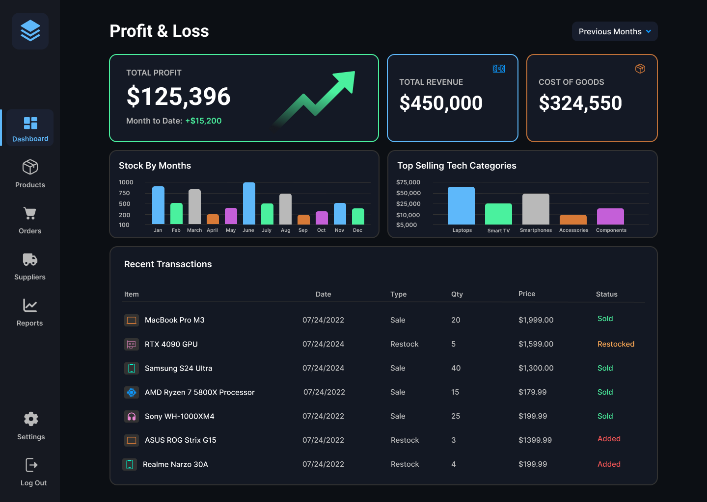

# ⚡ TechStock Pro: Inventory Management System

 

## 📸 Application Preview

## 📖 Overview

**TechStock Pro** is a specialized desktop inventory solution designed for **Electronics Retailers**. Unlike generic inventory tools, this system is optimized for tracking high-value assets with complex specifications (Laptops, Smartphones, Components).

This project demonstrates a professional implementation of a **Layered Architecture** using **C#** and **.NET**, focusing on separation of concerns, data integrity, and a responsive user interface.

> **Note:** This project is currently under active development as part of a portfolio showcase.

## 🚀 Key Features (Planned & Implemented)

- **Dashboard:** Real-time overview of low stock, total sales, and recent activity.
- **Product Management:**
  - CRUD operations (Create, Read, Update, Delete) for inventory items.
  - Categorization and supplier linking.
- **Stock Tracking:** Automatic adjustments to inventory levels upon sale or restocking.
- **Reporting:** Generation of sales reports and low-stock alerts.
- **Tech-First Data Modeling:** Tracks specific hardware attributes like **Brand**, **Model**, **Specs (RAM/SSD)**, and **SKU**.
- **High-Value Asset Tracking:** Real-time monitoring of stock value and "Low Stock" alerts for premium items.
- **Modern Dashboard:** A responsive, grid-based dashboard giving instant visibility into inventory health.
- **Audit-Ready:** (Planned) Tracks stock adjustments to prevent shrink/theft of expensive electronics.
- **User Authentication:** Secure login for Admins and Staff roles.

## 🛠️ Tech Stack

- **Language:** C#
- **Framework:** .NET 8.0 (Desktop)
- **UI Framework:** WPF (Windows Presentation Foundation)
- **Database:** SQL Server (MSSQL)
- **ORM:** Entity Framework Core
- **Architecture:** N-Layer Architecture (UI, Business Logic, Data Access)

## 🗺️ Development Roadmap

This project is being built in sprints. Current status:

- [x] **Phase 1: Architecture & Setup**

  - [x] Project solution structure (N-Layer setup).
  - [x] Database schema design and normalization.
  - [x] Git repository initialization.

- [ ] **Phase 2: Core Functionality (Current Focus)**

  - [ ] Implementation of Entity Framework Core DbContext.
  - [ ] Creation of Repositories and Services.
  - [ ] Product CRUD logic implementation.
  - [ ] Search & Filter by Brand/Spec.

- [ ] **Phase 3: UI & Integration**

  - [ ] Dashboard UI design.
  - [ ] Data binding and event handling.
  - [ ] Testing and Bug fixes.
  - [ ] Modern Dark Mode Layout Design.

## 📂 Project Structure

The solution follows industry-standard **Separation of Concerns**:

- `Core` - Domain Models (Product, Brand).
- `Data` - EF Core Context & Migrations.
- `Services` - Business Logic.
- `UI` - WPF Views & ViewModels.

## 📬 Contact

Created by **Kwon Daegun**.
Feel free to reach out via [Linkedin](https://www.linkedin.com/in/kwon-daegun/) regarding this project.
